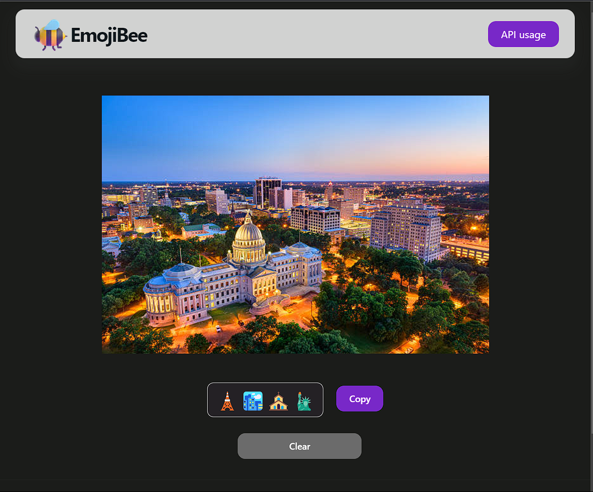

# EmojiBee
Emojibee combines the power of BLIP image captioning and GPT3 to suggest emojis for an image



## [API Usage](https://emojibee.newdev0.in/docs)

## ProductHunt

<a href="https://www.producthunt.com/posts/emojibee?utm_source=badge-featured&utm_medium=badge&utm_souce=badge-emojibee" target="_blank"></a>

### Sample

```
# input Image
```


```
> #Output
['🐻', '🤗', '🙋', '♂',  '🗻', '🌲', '🤔', '💭']
```
